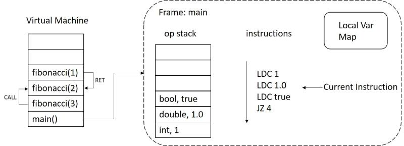

# Language Luna

## Team Members
- Yuan Cao [(@caoyuan0816)](https://github.com/caoyuan0816)
- Zelin Bao [(@baozelin)](https://github.com/baozelin)
- Yiru Hu [(@yiruhu)](https://github.com/yiruhu) 
- Zhang Lei [(@lanzhige)](https://github.com/lanzhige)

## YouTube Video Link
[https://youtu.be/EkllWYdYX_k](https://youtu.be/EkllWYdYX_k)

## Bonus Point
- Function Defination and Call (see `./data/fibonacci.lu`)
- Function Recursion (see `./data/fibonacci.lu`)
- Build-in Print Function (see `./data/fibonacci.lu`)
- Static Type Checking (see `./data/error.lu`)

## Language Luna
Luna is a lightweight, static typing, lua-like programming language. Luna provide a Flex and Bison based compiler and a stack based interpreter which called `lunac` and `luna`.

## Compile and Install Luna
### Platform
- Linux
- MacOS

### Prerequierment
- cmake (with c & c++ compiler support) (with c++11 feature)
- flex
- bison
- git (to clone project, you can also download project from [here](https://github.com/lanzhige/SER502-Spring2018-Team4/archive/master.zip))

### Fetch Project Source Code
- `git clone ://github.com/lanzhige/SER502-Spring2018-Team4.git`
- `cd SER502-Spring2017-Team10`

### Compile
- `./build.sh`, if the build process is failed, there will be an error message in the screen.

### Run Tests
- `./run,sh`, to run all test files inside directory data.

### Install
- `cd build && sudo make install && cd ..`, now you can use `luna` and `lunac` anywhere.

## Tools We Used to Develop Language Luna
[CMake](https://cmake.org/)  is an open-source, cross-platform family of tools designed to build, test and package software. CMake is used to control the software compilation process using simple platform and compiler independent configuration files, and generate native makefiles and workspaces that can be used in the compiler environment of your choice.<br />
We use CMake to generate the makefiles.

[Flex](https://www.gnu.org/software/flex/ ) is a fast lexical analyser generator. It is a tool for generating programs that perform pattern-matching on text. Flex is a free (but non-GNU) implementation of the original Unix lex program.<br />
We use bison to  convert a sequence of characters into a sequence of tokens.

[Bison](https://www.gnu.org/software/bison/) is a general-purpose parser generator that converts an annotated context-free grammar into a deterministic LR or generalized LR (GLR) parser employing LALR(1) parser tables. Bison is upward compatible with Yacc: all properly-written Yacc grammars ought to work with Bison with no change. <br />
We use bison to  analyze a sequence of tokens to determine its grammatical structure.

[valgrind](http://valgrind.org/) is an instrumentation framework for building dynamic analysis tools. There are Valgrind tools that can automatically detect many memory management and threading bugs, and profile your programs in detail. You can also use Valgrind to build new tools. <br />
(todo ..descirpt ..)

[Doxygen](https://en.wikipedia.org/wiki/Doxygen), a tool for writing software reference documentation. The documentation is written within code, and is thus relatively easy to keep up to date. Doxygen can cross reference documentation and code, so that the reader of a document can easily refer to the actual code. <br />
We use _doxygen_ to comments our code and create a documentation.

## Language Design
### Grammar 
```
file :              functiondef_list MAIN LPAREN variable COMMA variable RPAREN block END |
                    functiondef_list MAIN LPAREN RPAREN block END ;

block :             statement_list | ;

statement_list :    statement_list statement | statement ;

statement :         assign_statement | functioncall | do_statement | loop_statement | if_statement | return_statement;

do_statement :      DO block END ;

loop_statement :    WHILE LPAREN bool_expression RPAREN DO block END | FOR identifier for_statement ;

for_statement :     ASSIGNMENT int_num COMMA int_num COMMA int_num DO block END |
                    IN list_expression DO block END |
                    IN identifier DO block END ;

if_statement :      IF LPAREN bool_expression RPAREN block else_statement END;

else_statement :    ELSE block | ;

assign_statement :  define_assign | identifier_assign | unary_assign;

unary_assign :      identifier unaryop ;

identifier_assign : identifier ASSIGNMENT assign_type ;

define_assign :     variable ASSIGNMENT assign_type ;

assign_type :       expression | TRUE | FALSE | list_expression ;

variable :          type identifier ;

functioncall :      identifier argument_list ;

argument_list :     LPAREN RPAREN | LPAREN expression_list RPAREN ;

expression_list :   expression_list COMMA expression ;

bool_expression :   FALSE | TRUE | expression boolop expression ;

expression :        math_expression ;

list_expression :   LBRAC int_list RBRAC | LBRAC RBRAC ;

math_expression :   math_expression addop term | term ;

term :              term mulop num_id | num_id | functioncall ;

functiondef_list :  functiondef_list functiondef ;

functiondef :       FUNCTION variable funcbody ;

funcbody :          LPAREN paramlist RPAREN block END | LPAREN RPAREN block END ;

return_statement :  RETURN expression ;

paramlist :         paramlist COMMA variable | ;

addop :             PLUS | MINUS ; 

mulop :             STAR | SLASH ;

unaryop :           INCO | DECO ;

boolop :            EQUAL | GE | LE | LT | GT | NOTEQUAL ;

type :              bool_type | int_type | double_type | list_type ;

bool_type :         BOOL ;

int_type :          INT ;

double_type :       DOUBLE ;

list_type :         LIST ;

num_id :            identifier | num ;

num :               int_num | real_num ;

int_list :          int_list COMMA int_num | int_num ;

real_num :          MINUS REALNUMBER | REALNUMBER ;

int_num :           MINUS INTNUM | INTNUM ;

identifier :        IDENTIFIER ;
```
### Byte Code
```
------------------------------------------------------------------------------
1. Assignment Instrctions 
------------------------------------------------------------------------------
LDV a        | Operand: 1        | Load the variable into stack using given name
LDC 10       | Operand: 1        | Load the constant into stack
ASN x        | Operand: 1        | Assign top element of stack to given variable name
DUP          | Operand: 0        | Duplicate the top element of stack
---------------------------------------------------------------------
2. Arithmetic Instrctions (Pop two elements from stack, add them, push result back)
---------------------------------------------------------------------
ADD          | Operand: 0        | Addition.
SUB          | Operand: 0        | Substraction.
MUL          | Operand: 0        | Multiplication.
DIV          | Operand: 0        | Division.
---------------------------------------------------------------------
3. Comparison Instructions (Pop two elements from stack, check relationship between them, push result back.
)
---------------------------------------------------------------------
GT           | Operand: 0        | a > b
GE           | Operand: 0        | a >= b
LT           | Operand: 0        | a < b
LE           | Operand: 0        | a <= b
EQ           | Operand: 0        | a == b
NEQ          | Operand: 0        | a != b
---------------------------------------------------------------------
4. Jump Instructions
---------------------------------------------------------------------
JMP 10       | Operand: 1        | No condition jump, jump to given line
JZ 10        | Operand: 1        | Jump if zero, if top element of stack is zero, jump
---------------------------------------------------------------------
5. Function Call Instrctions
---------------------------------------------------------------------
RET          | Operand: 0        | Return to parent function
CALL fun 1   | Operand: 2        | Call function by function name and arguments number
---------------------------------------------------------------------
6. Termination Instruction
---------------------------------------------------------------------
HALT         | Operand: 0        | Immediately terminate program  
---------------------------------------------------------------------
```

### Virtual Machine Design


## Examples
### Fibonacci (`cat data/fibonacci.lu`)
```
function int fibonacci(int n)
    if (n==1)
        return 1
    end
    if (n==2)
        return 1
    end
    return fibonacci(n-2) + fibonacci(n-1) //Recursion call
end

main()
    int res = fibonacci(3)
    print(res)
end
```
Byte-code will be generated: (lunac data/fibonacci.lu && cat data/fibonacci.luo)
```
fibonacci
LDV n
LDC 1
EQ
JZ 6
LDC 1
RET
LDV n
LDC 2
EQ
JZ 12
LDC 1
RET
LDV n
LDC 2
SUB
CALL fibonacci 1
LDV n
LDC 1
SUB
CALL fibonacci 1
ADD
RET
main
LDC 3
CALL fibonacci 1
ASN res
LDV res
CALL print 1
```
Run the bytecode file by luna virtual machine: (luna data/fibonacci.luo)
```
2
```

## Contribution
Lei Zhang: scanner, parser, AST generating.<br />
Zelin Bao: bytecode generator(for, if, while blocks), testing<br />
Yiru Hu: bytecode generator(others), testing<br />
Yuan Cao: interpreter(stack-based virtual machine) and bash scripts<br />

